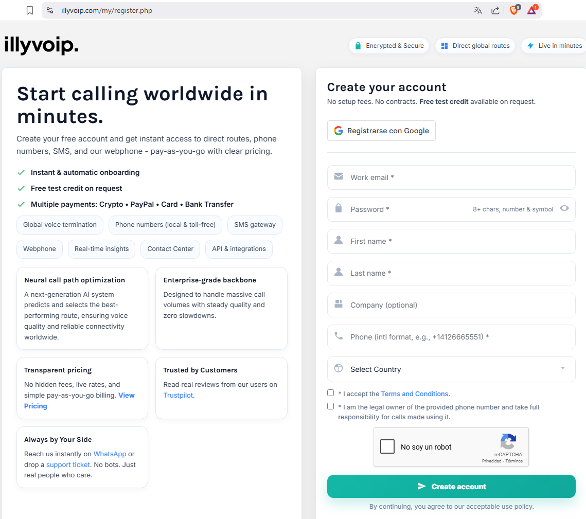
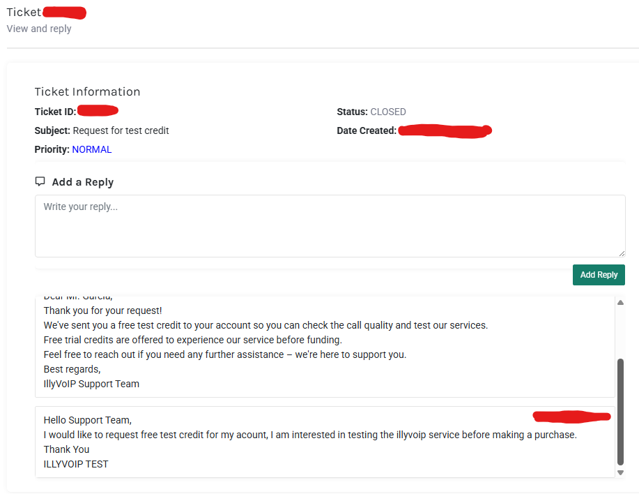
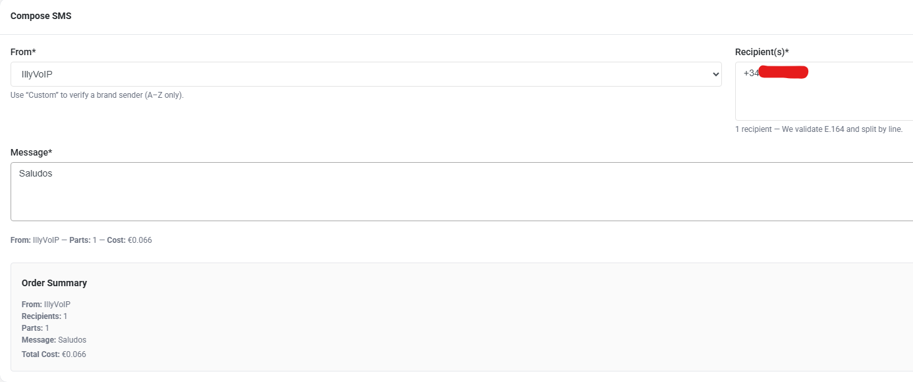
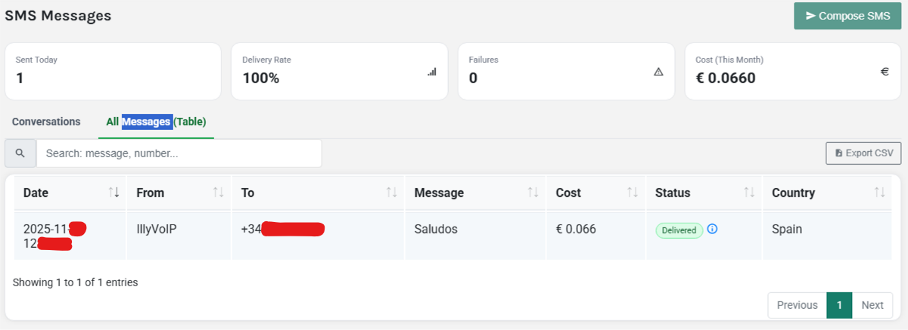
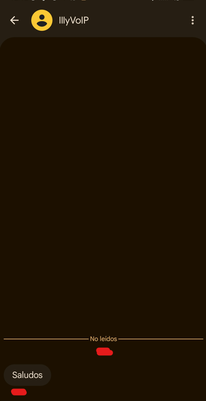
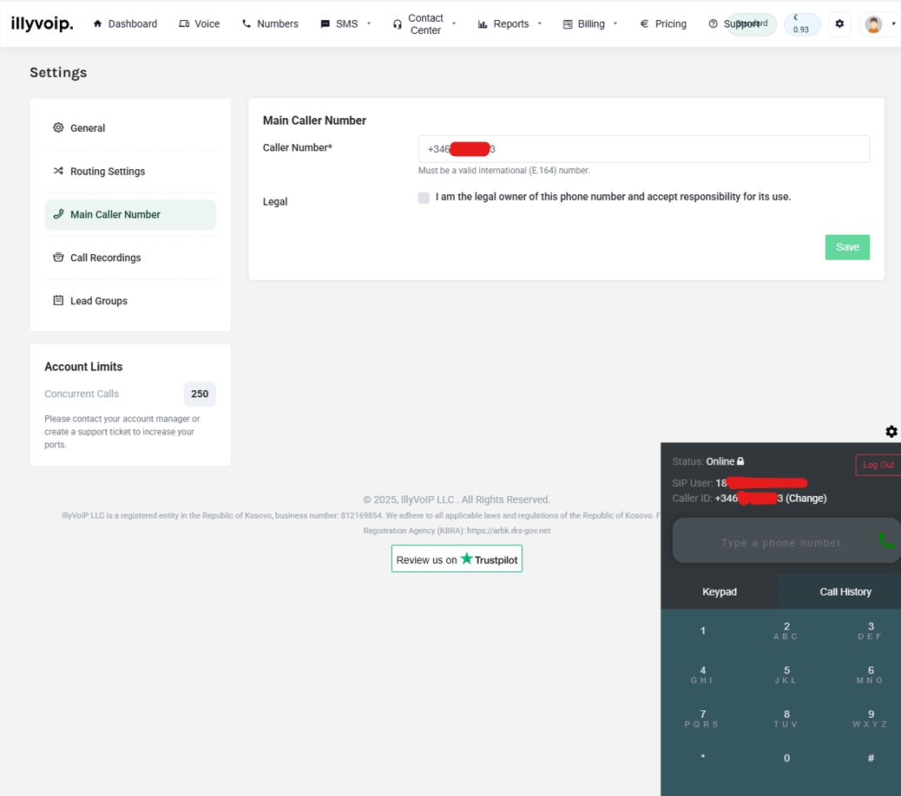

# Investigación de Seguridad: Análisis de Spoofing en SMS y Llamadas VoIP

## Resumen Ejecutivo

Esta investigación de seguridad se centra en el análisis de vulnerabilidades críticas en servicios de telefonía IP, específicamente en la plataforma IllyVoIP. El estudio demuestra cómo actores maliciosos pueden explotar estas vulnerabilidades para realizar ataques de suplantación de identidad a través de SMS y llamadas telefónicas. 

**🔒 Aviso Legal**: Todas las pruebas se realizaron en un entorno completamente controlado, con dispositivos propios, números telefónicos autorizados y consentimiento explícito de todas las partes involucradas.

## Proceso de Registro en la Plataforma

El primer paso de la investigación consistió en el registro en la plataforma IllyVoIP. Como se puede observar en la siguiente imagen, el proceso de registro requiere información básica del usuario pero carece de verificaciones robustas de identidad:

El formulario solicita datos como email corporativo, nombre, apellidos y número de teléfono, pero no existe una verificación rigurosa que impida el uso de información falsa o robada. Un atacante podría fácilmente registrar una cuenta utilizando datos de otra persona sin mayores obstáculos, representando la primera vulnerabilidad identificada en el sistema.

## Obtención del Crédito de Prueba

Una vez completado el registro, se procedió a solicitar el crédito de prueba de 1 euro que ofrece la plataforma. A través del sistema de tickets de soporte, se realizó la solicitud tal como muestra la siguiente captura:

La respuesta del equipo de soporte fue inmediata y sin verificaciones adicionales, otorgando el crédito solicitado sin cuestionar la identidad del usuario o el propósito del uso. Este hallazgo es particularmente preocupante, ya que demuestra la facilidad con que un atacante podría obtener recursos para realizar actividades maliciosas. Es importante mencionar que, aunque el crédito se acredita instantáneamente, la plataforma impone una restricción de 24 horas antes de permitir el uso completo de los servicios.

## Análisis de Vulnerabilidades en SMS

Con la cuenta completamente activa, se procedió a evaluar la funcionalidad de envío de SMS. La interfaz de usuario, como se observa en la siguiente imagen, permite seleccionar entre una amplia gama de números telefónicos de diferentes países y operadoras:

Esta flexibilidad en la selección del número origen, combinada con la posibilidad de personalizar el nombre del remitente, crea un escenario ideal para campañas de smishing. Durante las pruebas controladas, se envió un SMS al dispositivo personal, obteniendo la siguiente confirmación:

El resultado final, recibido en el dispositivo móvil, demuestra la efectividad de la suplantación:

La capacidad de mostrar "Illyvoip" como remitente, o potencialmente cualquier otro nombre que un atacante elija, representa un riesgo significativo para la seguridad de los usuarios.

## Investigación de Llamadas Suplantadas

La investigación se extendió hacia las funcionalidades de voz, donde se descubrieron capacidades aún más preocupantes. El sistema permite configurar parámetros SIP y en algunos casos modificar el Caller ID, como se observa en la siguiente configuración:

Para demostrar este riesgo de manera controlada y ética, se utilizó el número de un colaborador (con consentimiento explícito) para realizar una llamada al dispositivo personal. El resultado, visible en la siguiente captura, fue contundente:

El teléfono mostró el número del colaborador como remitente de la llamada, a pesar de que él no era quien realmente estaba realizando la comunicación. Esta capacidad de suplantación representa un riesgo extremadamente alto para ataques de vishing y podría ser explotada para campañas de extorsión o ingeniería social.

## Escenarios de Ataque y Impacto Potencial

La gravedad de estas vulnerabilidades se manifiesta en múltiples escenarios de ataque realistas. Un atacante con conocimientos técnicos moderados podría registrar una cuenta con datos falsos, obtener crédito de prueba y comenzar inmediatamente campañas de suplantación masiva.

En el escenario de **suplantación bancaria**, el atacante enviaría SMS masivos aparentando venir de entidades financieras legítimas, redirigiendo a las víctimas hacia sitios de phishing diseñados para robar credenciales. La combinación de números con prefijos internacionales creíbles y nombres de remitente personalizables hace que estos mensajes sean extremadamente convincentes.

En el caso de **extorsión telefónica**, la capacidad de suplantar números oficiales de autoridades o empresas permitiría a los atacantes solicitar información personal confidencial o realizar demandas de pago bajo falsas pretensiones. La verosimilitud de estas llamadas las hace particularmente peligrosas.

Otro escenario preocupante es el de **campañas de desinformación**, donde los atacantes podrían utilizar números legítimos para difundir mensajes fraudulentos, dañando la reputación de empresas y creando situaciones de caos social.

## Fundamentos Técnicos de las Vulnerabilidades

La posibilidad de realizar estas suplantaciones tiene sus raíces en deficiencias estructurales de los protocolos de voz sobre IP. Los protocolos VoIP como SIP y RTP fueron diseñados primordialmente para garantizar funcionalidad y compatibilidad, relegando aspectos de seguridad a un segundo plano.

Entre los factores técnicos que permiten estas vulnerabilidades destacan:

- **Falta de autenticación estricta**: Muchos carriers confían ciegamente en la información del Caller ID recibida
- **Configuraciones permisivas**: Routers SIP que no validan adecuadamente el origen real de las llamadas
- **Interconexión de redes**: Diferentes niveles de seguridad entre proveedores interconectados
- **Compatibilidad retroactiva**: Necesidad de mantener soporte para sistemas legacy sin mecanismos de seguridad modernos

Además, la economía competitiva de los servicios VoIP lleva a muchos proveedores a priorizar la facilidad de uso sobre la seguridad, resultando en prácticas como la minimización de fricción en el registro y la oferta de pruebas gratuitas sin verificaciones robustas.

## Recomendaciones de Seguridad

### Para Usuarios Finales
- **Verificar siempre** las comunicaciones sensibles mediante canales oficiales conocidos
- **No confiar en el Caller ID** como prueba de identidad, ya que puede ser suplantado
- **Desconfiar de enlaces** en SMS no solicitados y evitar hacer clic en ellos
- **Validar la identidad** en llamadas importantes colgando y llamando al número oficial

### Para Proveedores de Servicio
- Implementar **verificación rigurosa de identidad** durante el registro
- Establecer **límites estrictos** para nuevos usuarios y comportamientos sospechosos
- **Monitorizar patrones** de uso anómalos y campañas de envío masivo
- Validar la **propiedad real** de los números utilizados como origen

### Para Desarrolladores
- Implementar **autenticación multifactor** obligatoria
- Validar **estrictamente los datos** de registro y actividad
- **Auditar regularmente** las configuraciones SIP y parámetros de seguridad
- **Monitorizar proactivamente** intentos de spoofing y uso malicioso

## Conclusión

Esta investigación demuestra de manera tangible cómo servicios legítimos de VoIP pueden ser utilizados para fines maliciosos cuando no se implementan controles de seguridad adecuados. La facilidad con que se pueden eludir las medidas de verificación básicas y la potencia de las capacidades de suplantación disponibles representan una amenaza significativa para la seguridad de las comunicaciones telefónicas.

Lo más preocupante es que IllyVoIP no constituye un caso aislado. Existen numerosas plataformas similares en el mercado, muchas de ellas con controles de seguridad aún más laxos. El conocimiento de estas técnicas es fundamental tanto para desarrollar mejores defensas como para educar al público general sobre los riesgos en el panorama moderno de las telecomunicaciones.

El compromiso ético ha sido fundamental en toda esta investigación, garantizando que todas las pruebas se realizaron con consentimiento explícito, en entornos controlados y sin afectación a terceros.

## Referencias

- [Video tutorial de referencia](https://www.youtube.com/watch?v=4yIohOXgzAQ&t=3s)
- Documentación técnica de protocolos VoIP
- Mejores prácticas OWASP para comunicaciones seguras

---

**🔐 IMPORTANTE**: Esta investigación tiene fines exclusivamente educativos. El conocimiento documentado debe utilizarse únicamente para fortalecer medidas de seguridad. La reproducción de estas técnicas sin consentimiento es ilegal y éticamente reprobable.

**Última actualización**: Diciembre 2024

